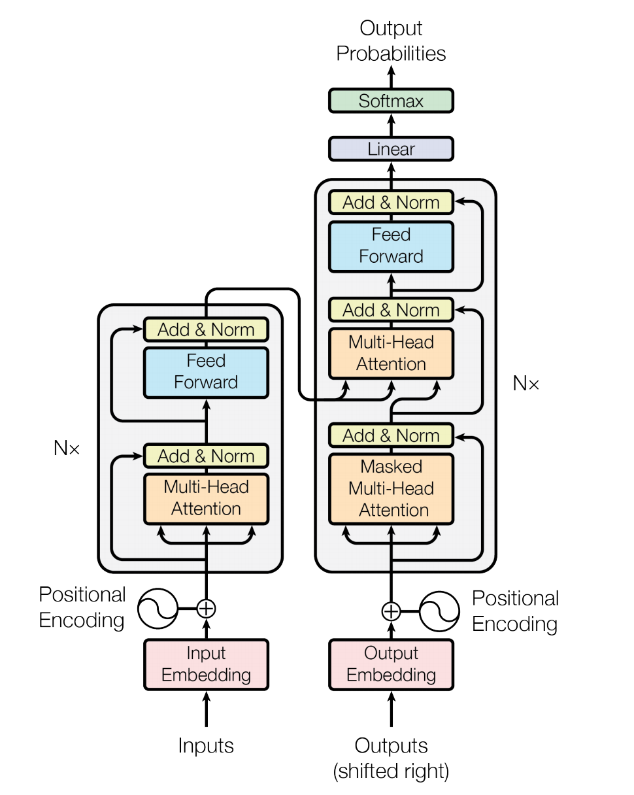
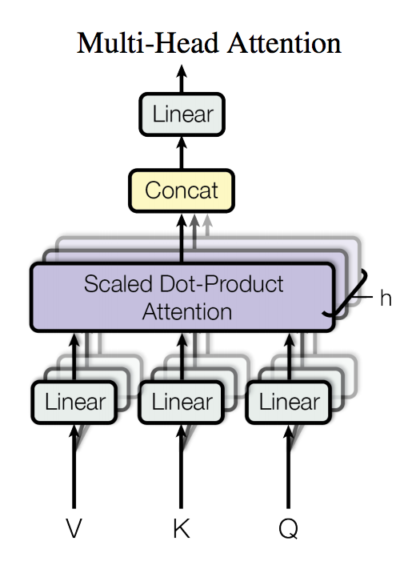

# Machine Translation using Transformer

机器翻译（Machine Translation）是利用计算机将一种自然语言(源语言)转换为另一种自然语言(目标语言)的过程，输入为源语言句子，输出为相应的目标语言的句子。

本项目是机器翻译领域主流模型 Transformer 的 PaddlePaddle 实现，包含模型训练，预测以及使用自定义数据等内容。用户可以基于发布的内容搭建自己的翻译模型。

## 模型介绍
Transformer 是论文 [Attention Is All You Need](https://arxiv.org/abs/1706.03762) 中提出的用以完成机器翻译（Machine Translation）等序列到序列（Seq2Seq）学习任务的一种全新网络结构，其完全使用注意力（Attention）机制来实现序列到序列的建模[1]。

<p align="center">
 <br />
图 1. Transformer 网络结构图
</p>

相较于此前 Seq2Seq 模型中广泛使用的循环神经网络（Recurrent Neural Network, RNN），使用 Self Attention 进行输入序列到输出序列的变换主要具有以下优势：

- 计算复杂度小
  - 特征维度为 d 、长度为 n 的序列，在 RNN 中计算复杂度为 `O(n * d * d)` （n 个时间步，每个时间步计算 d 维的矩阵向量乘法），在 Self-Attention 中计算复杂度为 `O(n * n * d)` （n 个时间步两两计算 d 维的向量点积或其他相关度函数），n 通常要小于 d 。
- 计算并行度高
  - RNN 中当前时间步的计算要依赖前一个时间步的计算结果；Self-Attention 中各时间步的计算只依赖输入不依赖之前时间步输出，各时间步可以完全并行。
- 容易学习长程依赖（long-range dependencies）
  - RNN 中相距为 n 的两个位置间的关联需要 n 步才能建立；Self-Attention 中任何两个位置都直接相连；路径越短信号传播越容易。

Transformer 中引入使用的基于 Self-Attention 的序列建模模块结构，已被广泛应用在 Bert [2]等语义表示模型中，取得了显著效果。

### 模型特点

Transformer 中的 Encoder 由若干相同的 layer 堆叠组成，每个 layer 主要由多头注意力（Multi-Head Attention）和全连接的前馈（Feed-Forward）网络这两个 sub-layer 构成。
- Multi-Head Attention 在这里用于实现 Self-Attention，相比于简单的 Attention 机制，其将输入进行多路线性变换后分别计算 Attention 的结果，并将所有结果拼接后再次进行线性变换作为输出。参见图2，其中 Attention 使用的是点积（Dot-Product），并在点积后进行了 scale 的处理以避免因点积结果过大进入 softmax 的饱和区域。
- Feed-Forward 网络会对序列中的每个位置进行相同的计算（Position-wise），其采用的是两次线性变换中间加以 ReLU 激活的结构。

此外，每个 sub-layer 后还施以 Residual Connection [3] 和 Layer Normalization [4] 来促进梯度传播和模型收敛。

<p align="center">
 <br />
图 2. Multi-Head Attention
</p>

Decoder 具有和 Encoder 类似的结构，只是相比于组成 Encoder 的 layer ，在组成 Decoder 的 layer 中还多了一个 Multi-Head Attention 的 sub-layer 来实现对 Encoder 输出的 Attention，这个 Encoder-Decoder Attention 在其他 Seq2Seq 模型中也是存在的。

## 数据准备

本示例可以使用 PaddleNLP 内置的处理好的 WMT14 EN-DE 翻译的数据进行训练、预测，也可以使用自定义数据集。数据准备部分可以参考前页文档 [使用自定义翻译数据集](../README.md)。

## 动态图

### 使用内置数据集进行训练

以下文档，介绍了使用 PaddleNLP 内置的处理好的 WMT14 EN-DE 翻译数据集的训练方式。

#### 单机单卡

以提供的英德翻译数据为例，可以执行以下命令进行模型训练：

``` sh
# Setting visible devices for training
export CUDA_VISIBLE_DEVICES=0
python train.py --config ./configs/transformer.base.yaml
```

可以在 `configs/transformer.big.yaml` 和 `configs/transformer.base.yaml` 文件中设置相应的参数。如果执行不提供 `--config` 选项，程序将默认使用 big model 的配置。

如果是在单卡下进行训练，可能需要适当调整下参数，比如考虑增大 `warmup_steps` 参数为 `16000`，相关的设置可以参考 `configs/transformer.big.yaml` 或是 `configs/transformer.base.yaml` 配置文件中各个选项。

#### 单机多卡

同样，可以执行如下命令实现八卡训练：

``` sh
unset CUDA_VISIBLE_DEVICES
python -m paddle.distributed.launch --gpus "0,1,2,3,4,5,6,7" train.py --config ./configs/transformer.base.yaml
```

与上面的情况相似，可以在 `configs/transformer.big.yaml` 和 `configs/transformer.base.yaml` 文件中设置相应的参数。如果执行不提供 `--config` 选项，程序将默认使用 big model 的配置。

### 使用自定义数据集进行训练

自定义数据集与内置数据集训练的方式基本上是一致的，不过需要额外提供数据文件的路径。可以参照以下文档。

#### 单机单卡

本示例这里略去自定义数据下载、处理的步骤，如果需要，可以参考前页文档 [使用自定义翻译数据集](../README.md)。

本示例以处理好的 WMT14 数据为例。

``` bash
DATA_DEST_DIR=${PATH_TO_PADDLENLP}/PaddleNLP/examples/machine_translation/data/wmt14_en_de/

python train.py \
    --config configs/transformer.base.yaml \
    --train_file ${DATA_DEST_DIR}/train.de-en.en ${DATA_DEST_DIR}/train.de-en.de \
    --dev_file ${DATA_DEST_DIR}/dev.de-en.en ${DATA_DEST_DIR}/dev.de-en.de \
    --src_vocab ${DATA_DEST_DIR}/dict.en.txt \
    --trg_vocab ${DATA_DEST_DIR}/dict.de.txt \
    --bos_token "<s>" \
    --eos_token "</s>" \
    --unk_token "<unk>" \
    --pad_token "<s>"
```

`train.py` 脚本中，各个参数的含义如下：

* `--config`: 指明所使用的 Transformer 的 config 文件，包括模型超参、训练超参等，默认是 `transformer.big.yaml`。即，默认训练 Transformer Big 模型。
* `--data_dir`: 指明训练需要的数据集的路径。无需提供不同的 train、dev 和 test 文件具体的文件名，会自动根据 `--src_lang` 和 `--trg_lang` 指定的语言进行构造。train、dev 和 test 默认的文件名分别为 [train|dev|test].{src_lang}-{trg_lang}.[{src_lang}|{trg_lang}]。且 `--data_dir` 设置的优先级会高于后面提到的 `--train_file`，`--dev_file` 和 `--test_file` 的优先级。
  * `--src_lang`(`-s`): 指代翻译模型的源语言。比如 `de` 表示德语，`en` 表示英语，`fr` 表示法语等等。和数据集本身相关。
  * `--trg_lang`(`-t`): 指代翻译模型的目标语言。比如 `de` 表示德语，`en` 表示英语，`fr` 表示法语等等。和数据集本身相关。
* `--train_file`: 指明训练所需要的 `train` 训练集的数据集的路径。若没有提供 `--data_dir` 或是需要特别指明训练数据的名称的时候指定。指定的方式为，一组平行语料的源语言和目标语言，依次两个文件的路径和名称，`--train_file ${SOURCE_LANG_FILE} ${TARGET_LANG_FILE}`。比如，`--train_file ${DATA_DEST_DIR}/train.de-en.de ${DATA_DEST_DIR}/train.de-en.en`。
* `--dev_file`: 指明训练所需要的 `dev` 验证集的数据集的路径。若没有提供 `--data_dir` 或是需要特别指明训练数据的名称的时候指定。指定的方式为，一组平行语料的源语言和目标语言，依次两个文件的路径和名称，`--dev_file ${SOURCE_LANG_FILE} ${TARGET_LANG_FILE}`。比如，`--dev_file ${DATA_DEST_DIR}/dev.de-en.de ${DATA_DEST_DIR}/dev.de-en.en`。
* `--vocab_file`: 指明训练所需的词表文件的路径和名称。若指定 `--vocab_file` 则默认是源语言和目标语言使用同一个词表。且 `--vocab_file` 设置的优先级会高于后面提到的 `--src_vocab` 和 `--trg_vocab` 优先级。
* `--src_vocab`: 指明训练所需的源语言的词表文件的路径和名称。可以与 `--trg_vocab` 相同，若相同，则视为源语言和目标语言共用同一个词表。
* `--trg_vocab`: 指明训练所需的目标语言的词表文件的路径和名称。可以与 `--src_vocab` 相同，若相同，则视为源语言和目标语言共用同一个词表。
* `--unk_token`: 若提供了自定义的词表，则需要额外指明词表中未登录词 `[UNK]` 具体的 token。比如，`--unk_token "<unk>"`。默认为 `<unk>`，与数据预处理脚本设定默认值相同。
* `--bos_token`: 若提供了自定义的词表，则需要额外指明词表中起始词 `[BOS]` 具体的 token。比如，`--bos_token "<s>"`。默认为 `<s>`，与数据预处理脚本设定默认值相同。
* `--eos_token`: 若提供了自定义的词表，则需要额外指明词表中结束词 `[EOS]` 具体的 token。比如，`--eos_token "</s>"`。默认为 `</s>`，与数据预处理脚本设定默认值相同。
* `--pad_token`: 若提供了自定义的词表，原则上，需要额外指定词表中用于表示 `[PAD]` 具体的 token。比如，`--pad_token "<pad>"`。默认为 None，若使用 None，则使用 `--bos_token` 作为 `pad_token` 使用。
* `--batch_size`: 指明训练时，一个 batch 里面，最多的 token 的数目。默认为 config 中设置的 4096。
* `--max_iter`: 指明训练时，需要训练的最大的 step 的数目，默认为 None。表示使用 config 中指定的 `epoch: 30` 来作为最大的迭代的 epoch 的数量，而不是 step。
* `--use_amp`: 是否使用混合精度训练。设置的类型是一个 `str`，可以是 `['true', 'false', 'True', 'False']` 中任意一个。默认不使用混合精度训练。
* `--amp_level`: 若使用混合精度，则指明混合精度的级别。可以是 `['O1', 'O2']` 中任意一个。默认是 `O1`。

#### 单机多卡

单机多卡的执行方式与单机打卡差别不大，需要额外加上单机多卡的启动命令，如下所示：

``` bash
DATA_DEST_DIR=${PATH_TO_PADDLENLP}/PaddleNLP/examples/machine_translation/data/wmt14_en_de/

python -m paddle.distributed.launch --gpus "0,1,2,3,4,5,6,7" train.py \
    --config configs/transformer.base.yaml \
    --train_file ${DATA_DEST_DIR}/train.de-en.en ${DATA_DEST_DIR}/train.de-en.de \
    --dev_file ${DATA_DEST_DIR}/dev.de-en.en ${DATA_DEST_DIR}/dev.de-en.de \
    --src_vocab ${DATA_DEST_DIR}/dict.en.txt \
    --trg_vocab ${DATA_DEST_DIR}/dict.de.txt \
    --bos_token "<s>" \
    --eos_token "</s>" \
    --unk_token "<unk>"
```

其余启动参数与单机单卡相同，这里不再累述。

### 模型推断

#### 使用内置数据集进行预测

如果是基于内置的数据集训练得到的英德翻译的模型，模型训练完成后可以执行以下命令对指定文件中的文本进行翻译：

``` sh
# setting visible devices for prediction
export CUDA_VISIBLE_DEVICES=0
python predict.py --config ./configs/transformer.base.yaml
```

翻译结果会输出到 `output_file` 指定的文件。执行预测时需要设置 `init_from_params` 来给出模型所在目录，更多参数的使用可以在 `configs/transformer.big.yaml` 和 `configs/transformer.base.yaml` 文件中查阅注释说明并进行更改设置。如果执行不提供 `--config` 选项，程序将默认使用 big model 的配置。

需要注意的是，目前预测仅实现了单卡的预测，原因在于，翻译后面需要的模型评估依赖于预测结果写入文件顺序，多卡情况下，目前暂未支持将结果按照指定顺序写入文件。

#### 基于自定义数据集进行预测

本示例同样支持自定义数据集进行预测。可以参照以下文档。

``` bash
DATA_DEST_DIR=${PATH_TO_PADDLENLP}/PaddleNLP/examples/machine_translation/data/wmt14_en_de/

python predict.py \
    --config configs/transformer.base.yaml \
    --test_file ${DATA_DEST_DIR}/test.de-en.en \
    --src_vocab ${DATA_DEST_DIR}/dict.en.txt \
    --trg_vocab ${DATA_DEST_DIR}/dict.de.txt \
    --bos_token "<s>" \
    --eos_token "</s>" \
    --unk_token "<unk>"
```

以下是各个参数的含义：

* `--config`: 指明所使用的 Transformer 的 config 文件，包括模型超参、训练超参等，默认是 `transformer.big.yaml`。即，默认训练 Transformer Big 模型。
* `--data_dir`: 指明训练需要的数据集的路径。无需提供不同的 train、dev 和 test 文件具体的文件名，会自动根据 `--src_lang` 和 `--trg_lang` 指定的语言进行构造。train、dev 和 test 默认的文件名分别为 [train|dev|test].{src_lang}-{trg_lang}.[{src_lang}|{trg_lang}]。且 `--data_dir` 设置的优先级会高于后面提到的 `--train_file`，`--dev_file` 和 `--test_file` 的优先级。
  * `--src_lang`(`-s`): 指代翻译模型的源语言。比如 `de` 表示德语，`en` 表示英语，`fr` 表示法语等等。和数据集本身相关。
  * `--trg_lang`(`-t`): 指代翻译模型的目标语言。比如 `de` 表示德语，`en` 表示英语，`fr` 表示法语等等。和数据集本身相关。
* `--test_file`: 指明训练所需要的 `test` 验证集的数据集的路径。若没有提供 `--data_dir` 或是需要特别指明训练数据的名称的时候指定。指定的方式为，传入源语言的文件。比如，`--test_file ${DATA_DEST_DIR}/test.de-en.de`。
* `--vocab_file`: 指明训练所需的词表文件的路径和名称。若指定 `--vocab_file` 则默认是源语言和目标语言使用同一个词表。且 `--vocab_file` 设置的优先级会高于后面提到的 `--src_vocab` 和 `--trg_vocab` 优先级。
* `--src_vocab`: 指明训练所需的源语言的词表文件的路径和名称。可以与 `--trg_vocab` 相同，若相同，则视为源语言和目标语言共用同一个词表。
* `--trg_vocab`: 指明训练所需的目标语言的词表文件的路径和名称。可以与 `--src_vocab` 相同，若相同，则视为源语言和目标语言共用同一个词表。
* `--unk_token`: 若提供了自定义的词表，则需要额外指明词表中未登录词 `[UNK]` 具体的 token。比如，`--unk_token "<unk>"`。默认为 `<unk>`，与数据预处理脚本设定默认值相同。
* `--bos_token`: 若提供了自定义的词表，则需要额外指明词表中起始词 `[BOS]` 具体的 token。比如，`--bos_token "<s>"`。默认为 `<s>`，与数据预处理脚本设定默认值相同。
* `--eos_token`: 若提供了自定义的词表，则需要额外指明词表中结束词 `[EOS]` 具体的 token。比如，`--eos_token "</s>"`。默认为 `</s>`，与数据预处理脚本设定默认值相同。
* `--pad_token`: 若提供了自定义的词表，原则上，需要额外指定词表中用于表示 `[PAD]` 具体的 token。比如，`--pad_token "<pad>"`。默认为 None，若使用 None，则使用 `--bos_token` 作为 `pad_token` 使用。
* `--without_ft`: 本示例在预测时，支持了 GPU 的翻译预测的加速，如果不使用加速特性，可以设置 `--without_ft` 即会执行普通的 PaddlePaddle 动态图预测。

翻译结果会输出到 config 文件中 `output_file` 条目指定的文件中。执行预测时需要设置 `init_from_params` 来给出模型所在目录，更多参数的使用可以在 `configs/transformer.big.yaml` 和 `configs/transformer.base.yaml` 文件中查阅注释说明并进行更改设置。

#### 导出静态图预测模型与预测引擎预测

Transformer 同时提供了将训练的动态图的 checkpoint 转成静态图模型功能，并提供了对应的使用预测引擎进行预测推理的方法。具体的使用方式如下：

首先是进行动转静，使用 `export_model.py` 脚本完成将动态图的 checkpoint 转成静态图的模型，并保存成 inference 的模型。

``` sh
python export_model.py --config ./configs/transformer.base.yaml
```

模型默认保存在 `infer_model/` 路径下面。可以在 `configs/` 路径下的配置文件中更改 `inference_model_dir` 配置，从而保存至自定义的路径。

同样，因为模型导出会用到模型的词表等信息，所以如果是**自定义数据集**，仍需要传入所使用的词表。

``` bash
DATA_DEST_DIR=${PATH_TO_PADDLENLP}/PaddleNLP/examples/machine_translation/data/wmt14_en_de/

python export_model.py \
    --config ./configs/transformer.base.yaml \
    --src_vocab ${DATA_DEST_DIR}/dict.en.txt \
    --trg_vocab ${DATA_DEST_DIR}/dict.de.txt \
    --bos_token "<s>" \
    --eos_token "</s>"
```

其中：

* `--vocab_file`: 指明训练所需的词表文件的路径和名称。若指定 `--vocab_file` 则默认是源语言和目标语言使用同一个词表。且 `--vocab_file` 设置的优先级会高于后面提到的 `--src_vocab` 和 `--trg_vocab` 优先级。
* `--src_vocab`: 指明训练所需的源语言的词表文件的路径和名称。可以与 `--trg_vocab` 相同，若相同，则视为源语言和目标语言共用同一个词表。
* `--trg_vocab`: 指明训练所需的目标语言的词表文件的路径和名称。可以与 `--src_vocab` 相同，若相同，则视为源语言和目标语言共用同一个词表。
* `--bos_token`: 若提供了自定义的词表，则需要额外指明词表中起始词 `[BOS]` 具体的 token。比如，`--bos_token "<s>"`。默认为 `<s>`，与数据预处理脚本设定默认值相同。
* `--eos_token`: 若提供了自定义的词表，则需要额外指明词表中结束词 `[EOS]` 具体的 token。比如，`--eos_token "</s>"`。默认为 `</s>`，与数据预处理脚本设定默认值相同。
* `--pad_token`: 若提供了自定义的词表，原则上，需要额外指定词表中用于表示 `[PAD]` 具体的 token。比如，`--pad_token "<pad>"`。默认为 None，若使用 None，则使用 `--bos_token` 作为 `pad_token` 使用。

#### 使用 Paddle Inference API 进行推理

准备好以上模型之后，可以使用预测引擎 Paddle Inference API 进行推理。

如果使用 Paddle Inference Python API，可以参考[使用 Paddle Inference Python API 推理](./deploy/python/README.md)。

如果使用 Paddle Inference C++ API，可以参考[使用 Paddle Inference C++ API 推理](./deploy/cpp/README.md)。

#### 使用 Paddle Serving 进行推理

除了使用 Paddle Inference API 进行本地推理外，还可以使用 Paddle Serving 实现在服务器上部署推理模型，客户端发送数据进行推理。可以参考[使用 Paddle Serving 推理](./deploy/serving/README.md)。

## 静态图

在静态图中，本示例仍然可以选择内置数据集进行训练或是使用自定义数据集进行训练。

### 使用内置数据集进行训练

#### 单机单卡

如果是需要单机单卡训练，则使用下面的命令进行训练：
``` shell
cd static/
export CUDA_VISIBLE_DEVICES=0
python train.py --config ../configs/transformer.base.yaml
```

建议可以在单卡执行的时候，尝试增大 `warmup_steps`。可以修改 `configs/transformer.big.yaml` 或是 `configs/transformer.base.yaml` 中对应参数。

#### 单机多卡

如果是需要单机多卡训练，则使用下面的命令进行训练：

##### PE 的方式启动单机多卡：
``` shell
cd static/
export CUDA_VISIBLE_DEVICES=0,1,2,3,4,5,6,7
python train.py --config ../configs/transformer.base.yaml
```

##### fleet 的方式启动单机多卡：
``` shell
cd static/
unset CUDA_VISIBLE_DEVICES
python -m paddle.distributed.launch --gpus="0,1,2,3,4,5,6,7" train.py --config ../configs/transformer.base.yaml --distributed
```

需要注意的是，使用 fleet 的方式启动单机多卡务必设置 `--distributed`。

### 使用自定义数据集进行训练

静态图和动态图在训练脚本启动上差别不大，仍然需要指明对应的文件的位置。可以参照以下文档。

#### 单机单卡

本示例这里略去自定义数据下载、处理的步骤，如果需要，可以参考前页文档 [使用自定义翻译数据集](../README.md)。

本示例以处理好的 WMT14 数据为例。

``` bash
cd static/
export CUDA_VISIBLE_DEVICES=0

DATA_DEST_DIR=${PATH_TO_PADDLENLP}/PaddleNLP/examples/machine_translation/data/wmt14_en_de/

python train.py \
    --config configs/transformer.base.yaml \
    --train_file ${DATA_DEST_DIR}/train.de-en.en ${DATA_DEST_DIR}/train.de-en.de \
    --src_vocab ${DATA_DEST_DIR}/dict.en.txt \
    --trg_vocab ${DATA_DEST_DIR}/dict.de.txt \
    --bos_token "<s>" \
    --eos_token "</s>" \
    --unk_token "<unk>"
```

`train.py` 脚本中，各个参数的含义如下：

* `--config`: 指明所使用的 Transformer 的 config 文件，包括模型超参、训练超参等，默认是 `transformer.big.yaml`。即，默认训练 Transformer Big 模型。
* `--data_dir`: 指明训练需要的数据集的路径。无需提供不同的 train、dev 和 test 文件具体的文件名，会自动根据 `--src_lang` 和 `--trg_lang` 指定的语言进行构造。train、dev 和 test 默认的文件名分别为 [train|dev|test].{src_lang}-{trg_lang}.[{src_lang}|{trg_lang}]。且 `--data_dir` 设置的优先级会高于后面提到的 `--train_file`，`--dev_file` 和 `--test_file` 的优先级。
  * `--src_lang`(`-s`): 指代翻译模型的源语言。比如 `de` 表示德语，`en` 表示英语，`fr` 表示法语等等。和数据集本身相关。
  * `--trg_lang`(`-t`): 指代翻译模型的目标语言。比如 `de` 表示德语，`en` 表示英语，`fr` 表示法语等等。和数据集本身相关。
* `--train_file`: 指明训练所需要的 `train` 训练集的数据集的路径。若没有提供 `--data_dir` 或是需要特别指明训练数据的名称的时候指定。指定的方式为，一组平行语料的源语言和目标语言，依次两个文件的路径和名称，`--train_file ${SOURCE_LANG_FILE} ${TARGET_LANG_FILE}`。比如，`--train_file ${DATA_DEST_DIR}/train.de-en.de ${DATA_DEST_DIR}/train.de-en.en`。
* `--vocab_file`: 指明训练所需的词表文件的路径和名称。若指定 `--vocab_file` 则默认是源语言和目标语言使用同一个词表。且 `--vocab_file` 设置的优先级会高于后面提到的 `--src_vocab` 和 `--trg_vocab` 优先级。
* `--src_vocab`: 指明训练所需的源语言的词表文件的路径和名称。可以与 `--trg_vocab` 相同，若相同，则视为源语言和目标语言共用同一个词表。
* `--trg_vocab`: 指明训练所需的目标语言的词表文件的路径和名称。可以与 `--src_vocab` 相同，若相同，则视为源语言和目标语言共用同一个词表。
* `--unk_token`: 若提供了自定义的词表，则需要额外指明词表中未登录词 `[UNK]` 具体的 token。比如，`--unk_token "<unk>"`。默认为 `<unk>`，与数据预处理脚本设定默认值相同。
* `--bos_token`: 若提供了自定义的词表，则需要额外指明词表中起始词 `[BOS]` 具体的 token。比如，`--bos_token "<s>"`。默认为 `<s>`，与数据预处理脚本设定默认值相同。
* `--eos_token`: 若提供了自定义的词表，则需要额外指明词表中结束词 `[EOS]` 具体的 token。比如，`--eos_token "</s>"`。默认为 `</s>`，与数据预处理脚本设定默认值相同。
* `--pad_token`: 若提供了自定义的词表，原则上，需要额外指定词表中用于表示 `[PAD]` 具体的 token。比如，`--pad_token "<pad>"`。默认为 None，若使用 None，则使用 `--bos_token` 作为 `pad_token` 使用。
* `--batch_size`: 指明训练时，一个 batch 里面，最多的 token 的数目。默认为 config 中设置的 4096。
* `--max_iter`: 指明训练时，需要训练的最大的 step 的数目，默认为 None。表示使用 config 中指定的 `epoch: 30` 来作为最大的迭代的 epoch 的数量，而不是 step。

#### 单机多卡

单机多卡下，执行方式与上文所述单机单卡传入自定义数据集方式相同。因静态图多卡有两种方式执行，所以这里会多一个参数：

* `--distributed`:（**多卡训练需要**）指明是否是使用 fleet 来启动多卡。若设置，则使用 fleet 启动多卡。具体使用方式如下。

##### PE 的方式启动单机多卡：
``` shell
cd static/
export CUDA_VISIBLE_DEVICES=0,1,2,3,4,5,6,7
python train.py \
    --config ../configs/transformer.base.yaml \
    --train_file ${DATA_DEST_DIR}/train.de-en.de ${DATA_DEST_DIR}/train.de-en.en \
    --src_vocab ${DATA_DEST_DIR}/dict.en.txt \
    --trg_vocab ${DATA_DEST_DIR}/dict.de.txt \
    --bos_token "<s>" \
    --eos_token "</s>" \
    --unk_token "<unk>"
```

##### fleet 的方式启动单机多卡：
``` shell
cd static/
unset CUDA_VISIBLE_DEVICES
python -m paddle.distributed.launch --gpus="0,1,2,3,4,5,6,7" train.py \
    --config ../configs/transformer.base.yaml \
    --distributed \
    --train_file ${DATA_DEST_DIR}/train.de-en.de ${DATA_DEST_DIR}/train.de-en.en \
    --src_vocab ${DATA_DEST_DIR}/dict.en.txt \
    --trg_vocab ${DATA_DEST_DIR}/dict.de.txt \
    --bos_token "<s>" \
    --eos_token "</s>" \
    --unk_token "<unk>"
```

需要注意的是，使用 fleet 的方式启动单机多卡务必设置 `--distributed`。

#### 使用内置数据集进行预测

如果是基于内置的数据集训练得到的英德翻译的模型，模型训练完成后可以执行以下命令对指定文件中的文本进行翻译：

``` sh
# setting visible devices for prediction
cd static/
export CUDA_VISIBLE_DEVICES=0
python predict.py --config ../configs/transformer.base.yaml
```

由 `predict_file` 指定的文件中文本的翻译结果会输出到 `output_file` 指定的文件。执行预测时需要设置 `init_from_params` 来给出模型所在目录，更多参数的使用可以在 `configs/transformer.big.yaml` 和 `configs/transformer.base.yaml` 文件中查阅注释说明并进行更改设置。如果执行不提供 `--config` 选项，程序将默认使用 big model 的配置。

需要注意的是，目前预测仅实现了单卡的预测，原因在于，翻译后面需要的模型评估依赖于预测结果写入文件顺序，多卡情况下，目前暂未支持将结果按照指定顺序写入文件。

#### 基于自定义数据集进行预测

本示例同样支持自定义数据集进行预测。可以参照以下文档。

``` bash
cd static/
export CUDA_VISIBLE_DEVICES=0

DATA_DEST_DIR=${PATH_TO_PADDLENLP}/PaddleNLP/examples/machine_translation/data/wmt14_en_de/
python predict.py \
    --config configs/transformer.base.yaml \
    --test_file ${DATA_DEST_DIR}/test.de-en.en \
    --src_vocab ${DATA_DEST_DIR}/dict.en.txt \
    --trg_vocab ${DATA_DEST_DIR}/dict.de.txt \
    --bos_token "<s>" \
    --eos_token "</s>" \
    --unk_token "<unk>"
```

以下是各个参数的含义：

* `--config`: 指明所使用的 Transformer 的 config 文件，包括模型超参、训练超参等，默认是 `transformer.big.yaml`。即，默认训练 Transformer Big 模型。
* `--data_dir`: 指明训练需要的数据集的路径。无需提供不同的 train、dev 和 test 文件具体的文件名，会自动根据 `--src_lang` 和 `--trg_lang` 指定的语言进行构造。train、dev 和 test 默认的文件名分别为 [train|dev|test].{src_lang}-{trg_lang}.[{src_lang}|{trg_lang}]。且 `--data_dir` 设置的优先级会高于后面提到的 `--train_file`，`--dev_file` 和 `--test_file` 的优先级。
  * `--src_lang`(`-s`): 指代翻译模型的源语言。比如 `de` 表示德语，`en` 表示英语，`fr` 表示法语等等。和数据集本身相关。
  * `--trg_lang`(`-t`): 指代翻译模型的目标语言。比如 `de` 表示德语，`en` 表示英语，`fr` 表示法语等等。和数据集本身相关。
* `--test_file`: 指明训练所需要的 `test` 验证集的数据集的路径。若没有提供 `--data_dir` 或是需要特别指明训练数据的名称的时候指定。指定的方式为，传入源语言的文件。比如，`--test_file ${DATA_DEST_DIR}/test.de-en.de`。
* `--vocab_file`: 指明训练所需的词表文件的路径和名称。若指定 `--vocab_file` 则默认是源语言和目标语言使用同一个词表。且 `--vocab_file` 设置的优先级会高于后面提到的 `--src_vocab` 和 `--trg_vocab` 优先级。
* `--src_vocab`: 指明训练所需的源语言的词表文件的路径和名称。可以与 `--trg_vocab` 相同，若相同，则视为源语言和目标语言共用同一个词表。
* `--trg_vocab`: 指明训练所需的目标语言的词表文件的路径和名称。可以与 `--src_vocab` 相同，若相同，则视为源语言和目标语言共用同一个词表。
* `--unk_token`: 若提供了自定义的词表，则需要额外指明词表中未登录词 `[UNK]` 具体的 token。比如，`--unk_token "<unk>"`。默认为 `<unk>`，与数据预处理脚本设定默认值相同。
* `--bos_token`: 若提供了自定义的词表，则需要额外指明词表中起始词 `[BOS]` 具体的 token。比如，`--bos_token "<s>"`。默认为 `<s>`，与数据预处理脚本设定默认值相同。
* `--eos_token`: 若提供了自定义的词表，则需要额外指明词表中结束词 `[EOS]` 具体的 token。比如，`--eos_token "</s>"`。默认为 `</s>`，与数据预处理脚本设定默认值相同。
* `--pad_token`: 若提供了自定义的词表，原则上，需要额外指定词表中用于表示 `[PAD]` 具体的 token。比如，`--pad_token "<pad>"`。默认为 None，若使用 None，则使用 `--bos_token` 作为 `pad_token` 使用。
* `--without_ft`: 本示例在预测时，支持了 GPU 的翻译预测的加速，如果不使用加速特性，可以设置 `--without_ft` 即会执行普通的 PaddlePaddle 动态图预测。

翻译结果会输出到 config 文件中 `output_file` 条目指定的文件中。执行预测时需要设置 `init_from_params` 来给出模型所在目录，更多参数的使用可以在 `configs/transformer.big.yaml` 和 `configs/transformer.base.yaml` 文件中查阅注释说明并进行更改设置。

## 模型评估

预测结果中每行输出是对应行输入的得分最高的翻译，对于使用 BPE 的数据，预测出的翻译结果也将是 BPE 表示的数据，要还原成原始的数据（这里指 tokenize 后的数据）才能进行正确的评估。评估过程具体如下（BLEU 是翻译任务常用的自动评估方法指标）：

``` sh
# 还原 predict.txt 中的预测结果为 tokenize 后的数据
sed -r 's/(@@ )|(@@ ?$)//g' predict.txt > predict.tok.txt
# 若无 BLEU 评估工具，需先进行下载
git clone https://github.com/moses-smt/mosesdecoder.git
# 以英德翻译 newstest2014 测试数据为例
perl mosesdecoder/scripts/generic/multi-bleu.perl ~/.paddlenlp/datasets/WMT14ende/WMT14.en-de/wmt14_ende_data/newstest2014.tok.de < predict.tok.txt
```

执行上述操作之后，可以看到类似如下的结果，此处结果是 big model 在 newstest2014 上的 BLEU 结果：
```
BLEU = 27.48, 58.6/33.2/21.1/13.9 (BP=1.000, ratio=1.012, hyp_len=65312, ref_len=64506)
```

## FAQ

**Q:** 预测结果中样本数少于输入的样本数是什么原因
**A:** 若样本中最大长度超过 `transformer.base.yaml` 或是 `transformer.big.yaml` 中 `max_length` 的默认设置，请注意运行时增大 `max_length` 的设置，否则超长样本将被过滤。

**Q:** 预测时最大长度超过了训练时的最大长度怎么办
**A:** 由于训练时 `max_length` 的设置决定了保存模型 position encoding 的大小，若预测时长度超过 `max_length`，请调大该值，会重新生成更大的 position encoding 表。


## 参考文献
1. Vaswani A, Shazeer N, Parmar N, et al. [Attention is all you need](http://papers.nips.cc/paper/7181-attention-is-all-you-need.pdf)[C]//Advances in Neural Information Processing Systems. 2017: 6000-6010.
2. Devlin J, Chang M W, Lee K, et al. [Bert: Pre-training of deep bidirectional transformers for language understanding](https://arxiv.org/abs/1810.04805)[J]. arXiv preprint arXiv:1810.04805, 2018.
3. He K, Zhang X, Ren S, et al. [Deep residual learning for image recognition](http://openaccess.thecvf.com/content_cvpr_2016/papers/He_Deep_Residual_Learning_CVPR_2016_paper.pdf)[C]//Proceedings of the IEEE conference on computer vision and pattern recognition. 2016: 770-778.
4. Ba J L, Kiros J R, Hinton G E. [Layer normalization](https://arxiv.org/pdf/1607.06450.pdf)[J]. arXiv preprint arXiv:1607.06450, 2016.
5. Sennrich R, Haddow B, Birch A. [Neural machine translation of rare words with subword units](https://arxiv.org/pdf/1508.07909)[J]. arXiv preprint arXiv:1508.07909, 2015.
