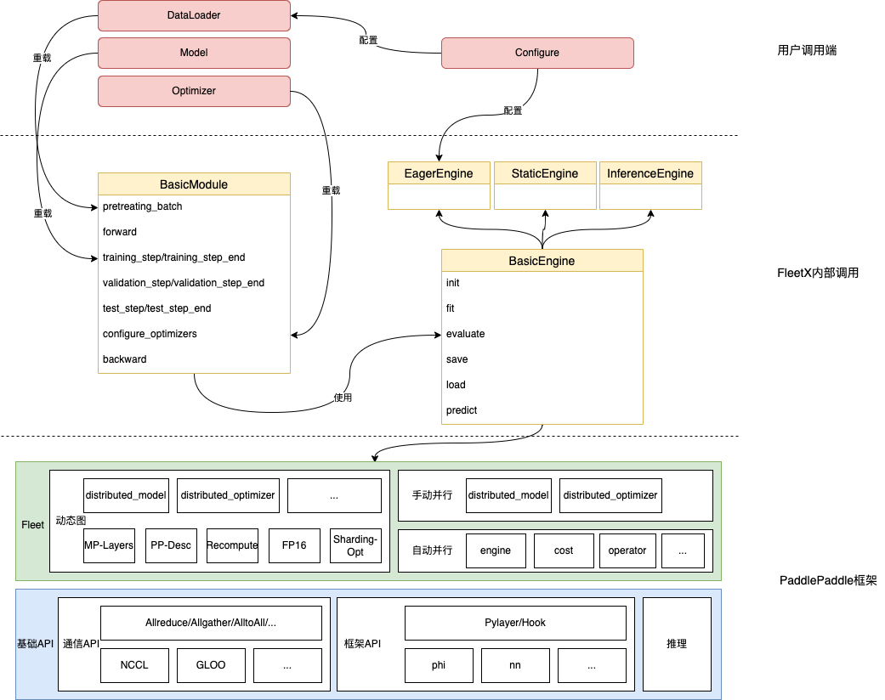

## 模型接入规范

本文讲述在PaddleFleetX repo接入一个新模型，该如何添加和修改文件，以及相应的规范化流程。

### 1.PaddleFleetX 介绍
PaddleFleetX是飞桨大模型训练推理一站式工具组件。与Paddle.distributed、Paddle.fleet API的关系如下：


<div align="center">


<em> PaddleFleetX与Paddle的关系 </em>
</div>


目前支持的模型列表如下：
- GPT


### 2.目录结构

整体的PaddleFleetX的目录结构如下：

```text
.
├── benchmarks                  # benchmark评估结果和示例代码
│   └── README.md
├── Dockerfile
├── docs                        # 文档
│   ├── cluster_deployment.md
│   ├── deployment_faq.md
│   ├── docker_install.md
│   ├── images
│   ├── quick_start.md
│   └── standard.md
├── ppfleetx
│   ├── configs
│   ├── core                    # 管理模型的组网规范，执行规范
│   ├── data                    # 数据集下载、预处理脚本
│   ├── models                  # 模型组网
│   ├── optims                  # 优化器类定义
│   └── utils
├── projects                    # 模型脚本，包含GPT模型
│   ├── gpt
├── README.md
├── requirements.txt
├── tasks
│   └── gpt
└── tools
    ├── auto.py
    ├── eval.py
    ├── export_model.py
    ├── inference.py
    └── train.py
```

### 3.模型接入方法

根据模型训练的阶段不同，整体分为两个阶段：组网阶段和执行阶段。
#### 3.1 组网阶段
需要不同的分布式策略，它们会调用github/PaddlePaddle/Paddle核心框架里面的分布式高层API（FleetAPI），参考：
需要的并行方式。
- [数据并行](https://www.paddlepaddle.org.cn/documentation/docs/zh/develop/guides/06_distributed_training/data_parallel/index_cn.html)
- [张量模型并行](https://www.paddlepaddle.org.cn/documentation/docs/zh/develop/guides/06_distributed_training/model_parallel_cn.html
)
- [流水线并行](https://www.paddlepaddle.org.cn/documentation/docs/zh/develop/guides/06_distributed_training/pipeline_parallel_cn.html)
- [分组切片并行](https://www.paddlepaddle.org.cn/documentation/docs/zh/develop/guides/06_distributed_training/group_sharded_parallel_cn.html)


#### 3.2 执行阶段
##### BasicModule
执行阶段采用Engine模块分装，为了能够保证Engine的模块化调用，需要将组网为``BasicModule``的子类，保证其规范化输出。其中``BasicModule``提供了多个统一的函数方法：

| **函数名**                      | **参数释义**               |
|------------------------------|------------------------|
| init | 接受用户的组网参数，实现Module初始化 |
| pretreating_batch | 预处理batch数据 |
| train_step    | 一次完整的训练                  |
| train_step_end  |   一次完整的训练后的操作                |
| training_epoch_end  | 一次完整的epoch训练后的操作                  |
| validation_step    | 一次完整的验证                  |
| validation_step_end  | 一次完整的验证后的操作                  |
| validation_epoch_end  | 一次完整的epoch验证后的操作                  |
| test_step    | 一次完整的测试                  |
| test_step_end  | 一次完整的测试后的操作                  |
| configure_optimizers  | 配置这次训练的优化器                  |

##### EagerEngine
``EagerEngine``将上述函数串联起来，实现底层的执行逻辑对上层的屏蔽，减少冗余代码。
初始化需要传入对应的config配置，其层级配置如下：

```yaml
Engine:
  max_steps: 500000
  num_train_epochs: 1
  accumulate_steps: 1
  logging_freq: 1
  eval_freq: 500
  eval_iters: 10
  test_iters:
  mix_precision:
    enable: True
    dtype: "float16"
    level: "O2"
    scale_loss: 32768.0
    custom_black_list: ["reduce_sum", "c_softmax_with_cross_entropy", "elementwise_div"]
    custom_white_list: ["lookup_table", "lookup_table_v2"]
  save_load:
    save_steps: 1000
    save_epoch: 1
    output_dir: ./output
    ckpt_dir:
```

其中参数对应的释义如下：

| **参数名**                      | **参数释义**               |
|------------------------------|------------------------|
| max_steps         | 最大训练步数                               |
| num_train_epochs  | 训练的epoch数量                           |
| accumulate_steps  | 梯度累加次数                           |
| logging_freq      | 训练日志打印的频率                            |
| eval_freq         | 模型评估间隔                               |
| eval_iters        | 模型评估时训练评估测试集的轮数                      |
| enable            | 是否使用混合精度策略进行训练                     |
| dtype             | 混合精度训练数据类型使用float16还是bfloat16，默认为float16类型 |
| level             | 混合精度训练模式，默认``O2``模式                 |
| scale_loss        | 使用fp16混合精度策略下，loss的放缩比例                  |
| custom_black_list | 自定义算子黑名单。这个名单中的算子在支持混合精度计算时会被认为是数值危险的，它们的影响也可能会在下游操作中观察到。这些算子通常不会转为float16/bfloat16计算 |
| custom_white_list | 自定义算子白名单。这个名单中的算子在支持混合精度计算时会被认为是数值安全的，并且对性能至关重要。如果设置了白名单，该名单中的算子会使用float16/bfloat16计算 |
| save_steps        | 保存模型间隔                               |
| save_epoch        | 保存模型epoch间隔                               |
| output_dir        | 指定输出文件                               |
| ckpt_dir          | checkpoint的加载目录                      |

``EagerEngine``中重载了多个常用函数，整体的说明如下：


| **函数名**                      | **参数释义**               |
|------------------------------|------------------------|
| fit | 模型训练 |
| evaluate | 模型评估 |
| predict    | 模型预测                 |
| save  |   模型参数保存                |
| load    | 模型参数加载                  |

其中module和engine函数方法的映射关系如下：

- fit

``fit``实现模型的训练，EagerEngine的内部调用伪代码如下：

```python
module.model.train()
for batch in train_dataloader:
    module.training_step()
    module.training_step_end()

    module.optimizer.step()
    module.lr_scheduler.step()

    module.optimizer.clear_grad()
```

- evaluate

``evaluate``实现模型的评估，``EagerEngine``的内部调用伪代码如下：

```python
with paddle.no_grad():
    module.model.eval()
    for batch in vailidation_dataloader:
        module.validation_step()
        module.validation_step_end()
```

- test

`` predict``实现模型的预测，``EagerEngine``的内部调用伪代码如下：

```python
with paddle.no_grad():
    module.model.eval()
    for batch in test_dataloader:
        module.predict_step()
        module.predict_step_end()
```


### 4.模型接入示例


1、构建组网文件，放置在`ppfleex/models`目录下。

```python
class SimpleNet(nn.Layer):
    def __init__(self):
        super(SimpleNet, self).__init__()
        self.fc1 = nn.Linear(IMAGE_SIZE, IMAGE_SIZE)
        self.fc2 = nn.Linear(IMAGE_SIZE, IMAGE_SIZE)
        self.fc3 = nn.Linear(IMAGE_SIZE, IMAGE_SIZE)
        self.fc4 = nn.Linear(IMAGE_SIZE, IMAGE_SIZE)
        self.fc5 = nn.Linear(IMAGE_SIZE, CLASS_NUM)

    def forward(self, image, label=None):
        output = self.fc1(image)
        output = self.fc2(output)
        output = self.fc3(output)
        output = self.fc4(output)
        return self.fc5(output)

class LossLayer(nn.Layer):
    def __init__(self):
        super(LossLayer, self).__init__()

    def forward(self, image, label=None):
        return F.cross_entropy(image, label)
```

2、构建BasicModule，设置符合要求的组网形式，放置在`ppfleetx/models`目录下；并引入`ppfleetx/models/__init__.py`

```python
class TestModule(BasicModule):
    def __init__(self):
        super().__init__()
        self.loss_fn = LossLayer()

    def get_model(self):
        model = SimpleNet()
        return model

    def forward(self, x):
        return self.model(x)

    def training_step(self, batch):
        x, y = batch
        loss = self.loss_fn(self(x), y)
        return loss

    def training_step_end(self, log_dict):
        logger.info(
            "[train] epoch: %d, batch: %d, loss: %.9f, avg_batch_cost: %.5f sec"
            % (log_dict['epoch'], log_dict['batch'], log_dict['loss'], log_dict['train_cost']))

    def validation_step(self, batch):
        x, y = batch
        loss = self.loss_fn(self(x), y)
        return loss

    def validation_step_end(self, log_dict):
        logger.info(
            "[eval] epoch: %d, batch: %d, loss: %.9f, avg_eval_cost: %.5f sec"
            % (log_dict['epoch'], log_dict['batch'], log_dict['loss'], log_dict['eval_cost']))

    def test_step(self, batch):
        x, y = batch
        loss = self.loss_fn(self(x), y)
        return loss

    def test_step_end(self, log_dict):
        logger.info(
            "[test] epoch: %d, batch: %d, loss: %.9f, avg_test_cost: %.5f sec"
            % (log_dict['epoch'], log_dict['batch'], log_dict['loss'], log_dict['test_cost']))

```
3、通过config配置Dataset

Dataset可以通过config文件进行配置。新增Dataset类型放置在 `ppfleetx/data/dataset`,同时其构造参数于其对应的Dataset字段一致。比如：

```python
class GPTDataset(paddle.io.Dataset):
    def __init__(self,
                 input_dir,
                 split,
                 max_seq_len,
                 num_samples,
                 mode,
                 seed=1234):
```
对应config中的yaml字段：

```yaml
Data:
  Train:
    dataset:
      name: GPTDataset
      input_dir: ./data/
      split: [949, 50, 1]
      max_seq_len: 1024
    sampler:
      name: DistributedBatchSampler
      shuffle: False
      drop_last: True
    loader:
      num_workers: 1
      return_list: False
      collate_fn: gpt_collate_fn
```

4、通过config配置Optimizer和LR


```yaml
Optimizer:
  name: FusedAdamW
  weight_decay: 0.01
  beta1: 0.9
  beta2: 0.999
  epsilon: 1.0e-8
  lr:
    name: CosineAnnealingWithWarmupDecay
    decay_steps: 360000
    warmup_rate: 0.01
    max_lr: 5.0e-5
    min_lr: 1.0e-5
  grad_clip:
    name: "ClipGradByGlobalNorm"
    clip_norm: 1.0
  tensor_fusion: False
```

5、运行模型相关的配置文件以及相应的运行脚本，放置在[projects](https://github.com/PaddlePaddle/PaddleFleetX/tree/develop/projects)目录。


### 5.模型推理示例

模型训练完成后，可使用飞桨高性能推理引擎Paddle Inference通过如下方式进行推理部署。
总共分为两个步骤：模型导出和推理部署。可以参考[GPT的模型推理](https://github.com/PaddlePaddle/PaddleFleetX/blob/develop/projects/gpt/docs/inference.md)。
